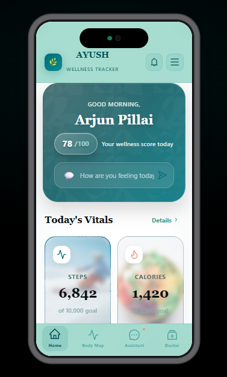

# AYUSH Health Tracker 🌿

**AYUSH Health Tracker** is a beautifully crafted, mobile-first React application designed with a "Dark Luxury Wellness" aesthetic. It serves as a holistic health companion, integrating Ayurvedic principles, yoga, nutrition, and modern vital tracking into a single, intuitive interface.

---

## 📸 App Previews


### 🏠 Home Dashboard
*Daily vitals, wellness score, and curated health stories.*



### 📍 Interactive Body Map
*Tap-to-select regions and symptom logging.*


### 🤖 AYUSH Assistant
*AI-powered holistic health companion.*


### 👨‍⚕️ Doctor Consultations
*Connect with certified AYUSH practitioners.*


---

## ✨ Features & Navigation Overview

The application is built around a persistent bottom navigation bar that divides the user experience into four core pillars of wellness:

### 🏠 1. Home Dashboard (The Daily Hub)
The central command center for daily health monitoring.
* **Daily Vitals Tracking:** Visual progress bars for Steps, Calories, Water intake, and Sleep duration against daily goals.
* **Wellness Score:** A dynamic daily score calculated to give users a quick snapshot of their overall health standing.
* **Mood & Symptom Logger:** A quick-input text field ("How are you feeling today?") to log daily sentiments.
* **Curated Content:** Horizontally scrolling "Health Stories" categorized by AYUSH disciplines (Ayurveda, Nutrition, Yoga, Siddha) and a Daily Wisdom quote card.

### 📍 2. Interactive Body Map (Targeted Diagnostics)
A visual, intuitive way to log physical discomfort without typing.
* **3D-Style SVG Silhouette:** A custom-rendered, interactive human body figure with glowing regional indicators.
* **Tap-to-Select Regions:** Users can tap specific areas (Head, Chest, Abdomen, Arms, Legs) to trigger localized symptom checkers.
* **Smart Symptom Modal:** A slide-up drawer containing specific, selectable symptom chips (e.g., Headache, Bloating, Cramps) mapped to the selected body part, which instantly feeds context to the AI Assistant.

### 🤖 3. AYUSH AI Assistant (Holistic Guidance)
A built-in conversational agent offering immediate, personalized health advice.
* **Context-Aware Chat:** Offers remedies and advice based on Ayurvedic principles, Dosha types, and user inputs.
* **Quick-Action Chips:** Pre-populated prompts (e.g., "Stress & anxiety", "Yoga for pain", "Better sleep") for fast answers.
* **Conversational UI:** A clean, modern chat feed with distinct AI and user message bubbles, mimicking a premium messaging app.

### 👨‍⚕️ 4. Doctor Consultations (Professional Care)
A comprehensive directory connecting users with certified AYUSH practitioners.
* **Specialty Filtering:** A horizontal scroll bar to filter doctors by discipline (All, Ayurveda, Yoga, Naturopathy, Homeopathy, Siddha).
* **Detailed Practitioner Cards:** Displays the doctor's name, specialty, years of experience, patient rating, and total consultations.
* **Live Availability:** Real-time status badges showing if a doctor is available "Now", in "30 min", or "Unavailable".
* **Direct Action Buttons:** One-tap buttons to initiate a text chat or a phone call with the selected specialist.

---

## ⚙️ Slide-Out Settings Drawer
Accessible via the top navigation menu, this drawer handles user preferences:
* **Profile Management:** Displays user details, streaks, and XP points.
* **Accessibility Toggles:** Quick switches for Large Text, Dark Mode, and Notifications.
* **Custom Reminders:** Configurable alerts for Water intake, Walks, and Meditation.
* **Health Profile:** A quick-reference view of static health data like Blood Group, Weight, Height, and Dosha Type.

---


## 🛠️ Tech Stack & Dependencies

This app is built with **React** and uses a custom-styled, responsive mobile shell. 

**Core Libraries:**
* `react`
* `antd` (Ant Design for the modal and configuration provider)
* `@ant-design/icons` (Standard UI icons)
* `lucide-react` (Modern, beautiful health/vital icons)

---

## 🚀 Getting Started

### 1. Install Dependencies
Run the following command in your project directory to install the required packages:

```bash
npm install antd @ant-design/icons lucide-react
